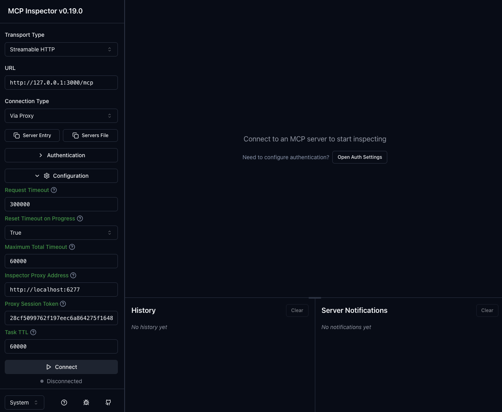
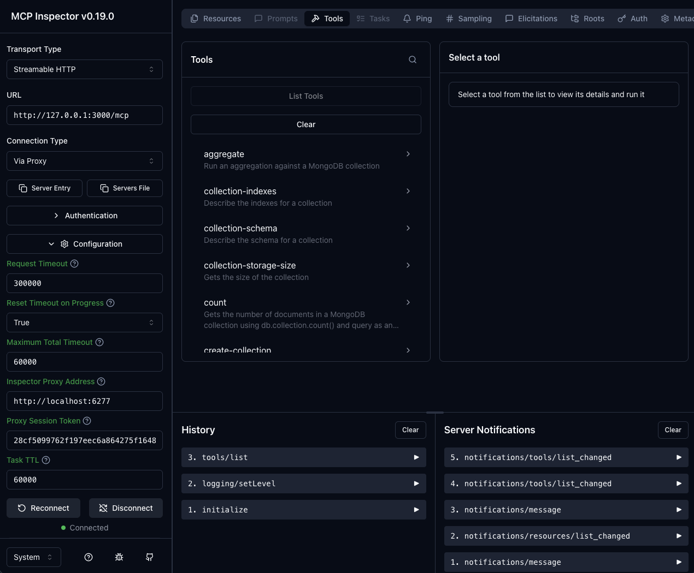

# Agentic AI with MCP (MongoDB Demonstration)

This directory demonstrates an **agentic AI workflow using MongoDB + MCP (Model Context Protocol)**.

The goal of this demo is to show how an AI agent can:

- Reason over MongoDB data using MCP tools
- Perform multi-step analysis (semantic retrieval + aggregation)
- Persist **agent memory** back into MongoDB
- Operate safely with human-in-the-loop controls
- Be observed and debugged via the MCP Inspector

The demo intentionally uses **public MongoDB sample datasets** (for example, `sample_mflix`) and **ephemeral MCP services** so it can be reproduced easily and safely.

---

## High-level Architecture

- **MongoDB Atlas**
  - System of record
  - Vector Search (Atlas Search)
  - Persistent agent memory
- **mongodb-mcp-server**
  - Exposes MongoDB capabilities via MCP
  - Run ephemerally via `npx` (not cloned into this repo)
- **MCP Inspector**
  - UI for inspecting tools, requests, and safety confirmations
  - The available MongoDB MCP Server Tools are also listed in the documentation:
    - [MongoDB MCP Server Tools](https://www.mongodb.com/docs/mcp-server/tools/#mongodb-mcp-server-tools)
- **Python**
  - Local orchestration
  - Embedding backfill scripts
  - Demo utilities
- **VoyageAI**
  - Vector embeddings (Voyage v4 family)

> **Important:** `mongodb-mcp-server` is *not* vendored into this repository.  
> It is launched ephemerally via `npx` during the demo.
---

## Prerequisites

- Python 3.10+
- Node.js 18+ (with `npx` available)
- Access to a MongoDB Atlas project
- MongoDB Atlas API credentials (service account)
- VoyageAI API key (for embeddings)

---

## Repository Layout

```text
mongodb-demonstrations/
└── agentic-ai-with-mcp/
    ├── README.md
    ├── requirements.txt
    ├── .env              # not committed
    ├── .venv/            # local Python virtual environment
    ├── api-examples/
    └── voyageai-vector-embeddings/
```

This repository intentionally **does not** contain a copy of `mongodb-mcp-server`, but documentation for it can be found in its own [Github Repository](https://github.com/mongodb-js/mongodb-mcp-server).

---

## Environment Variables (`.env`)

Create a `.env` file in this directory (`agentic-ai-with-mcp/`).  
This file is intentionally **not committed to git**, and is listed in .gitignore to prevent it from being accidentally committed.

```env
# MongoDB Atlas API credentials
MDB_MCP_API_CLIENT_ID=your_atlas_client_id
MDB_MCP_API_CLIENT_SECRET=your_atlas_client_secret

# Enable Atlas Search / Vector Search tools
MDB_MCP_PREVIEW_FEATURES=search

# VoyageAI API key (used for vector embeddings)
MDB_MCP_VOYAGE_API_KEY=your_voyage_api_key

# Require confirmation for write / destructive tools
MDB_MCP_CONFIRMATION_REQUIRED_TOOLS=insert-many,update-many,delete-many,drop-collection,drop-database

#Pymongo connection string
MONGODB_URI="mongodb+srv://..."

# Voyage
VOYAGE_MODEL="voyage-4"
VOYAGE_OUTPUT_DIM=1024

# MongoDB Atlas Database Variables
MEMORY_COLLECTION="agent_memory"

#Atlas Vector Search Indexes
COMMENTS_VECTOR_INDEX="comments_voyage_v4"
MEMORY_VECTOR_INDEX="memory_voyage_v4"
MOVIES_VECTOR_INDEX="movies_voyage_v4"


# Embedding field name (your preference)
EMBEDDING_FIELD="embedding_voyage_v4"
```

---

## Python Virtual Environment Setup

All Python dependencies for this demo are isolated to a local virtual environment.

From `agentic-ai-with-mcp/`:

```bash
python -m venv .venv
source .venv/bin/activate

pip install --upgrade pip
pip install -r requirements.txt
```

The `requirements.txt` file is included in this repository and contains all required Python packages. These packages are used for:

- `mcp[cli]`: MCP client utilities and CLI
- `pymongo`: MongoDB access from Python
- `voyageai`: Embedding backfill scripts
- `python-dotenv`: Local orchestration and experimentation

---

## Running the MCP Inspector with MongoDB MCP Server

The MongoDB MCP server is launched **ephemerally** using `npx` and inspected using the MCP Inspector.

### Step 1: Load environment variables

```bash
set -a
source .env
set +a
```

### Step 2: Start MCP Inspector and MongoDB MCP Server

```bash
npx -y @modelcontextprotocol/inspector   npx -y mongodb-mcp-server@latest --readOnly=false
```

This command will:

- Download `mongodb-mcp-server` from npm at runtime
- Launch it over STDIO
- Start the MCP Inspector UI (typically at http://localhost:6274)

### Step 3: Connect to the MCP Server in the MCP Inspector UI

Once the MCP Inspector has started, open the Inspector UI in your browser if it has not opened already (typically at http://localhost:6274).

Before connecting to the MongoDB MCP server, you **must populate the Inspector Proxy field**.

#### Required Proxy Address Configuration

In the left-hand configuration panel:

- **Inspector Proxy Address** must be set to:

```text
http://localhost:6277
```

This value tells the Inspector UI how to communicate with the MCP proxy that was started when launching the Inspector.

The **Proxy Session Token** should be auto-populated when the Inspector starts, but if not, it was printed to the CLI output when you start the Inspector in step 2.

The screenshot below shows the required proxy configuration before clicking Connect:

<!--  -->
<p align="center">
  
</p>
#### Available MongoDB MCP Tools

Once connected, the Inspector exposes all MongoDB MCP tools made available
by the running `mongodb-mcp-server`.

These tools allow an AI agent to:
- Read and analyze data (`find`, `aggregate`)
- Inspect schemas and indexes
- Perform vector search (when enabled)
- Persist agent memory (`insert-many`, `update-many`)
- Safely perform controlled write operations

The screenshot below shows the full set of MongoDB MCP tools available
in this demo environment:

<!--  -->
<p align="center">
  
</p>

> The server runs from an ephemeral npm cache and is discarded when the process exits.

---

## About Directory Structure and `npx`

The `npx` command  that starts the **MCP Inspector** above **does not depend on any local `mongodb-mcp-server` directory**.

- `npx mongodb-mcp-server@latest` downloads and runs the server dynamically
- The server does **not** need to exist anywhere in your filesystem
- Your current working directory does not matter

This approach is intentional and keeps the demo:

- Clean
- Reproducible
- Free of vendored Node.js dependencies

---

## Optional: Using a Local Clone (Not Required)

If you wish to inspect or debug the MongoDB MCP server implementation, you may clone it **outside this repository**, for example:

```text
~/src/mongodb-mcp-server/
mongodb-demonstrations/agentic-ai-with-mcp/
```

You could then run the Inspector against the local server entrypoint.

This is **not required** for this demo and is intentionally omitted to keep the repository focused and easy to understand.

---

## Demo Focus: Agent Memory

This demo emphasizes **agentic behavior**, specifically:

1. Retrieve similar "cases" using semantic meaning (vector search)
2. Validate hypotheses using MongoDB aggregations
3. Persist conclusions into a dedicated memory collection (for example, `mcp_config.agent_memory`)
4. Recall and compare past investigations in follow-up interactions

All memory writes are gated using MCP confirmation controls.

---

## Cleanup

When the demo is complete:

- Stop the MCP Inspector process
- Deactivate the Python virtual environment
- Optionally delete the `.venv/` directory

No permanent services or infrastructure changes are required.

---

## Repository Intent

This repository exists to demonstrate **how agentic AI systems can safely reason, act, and remember using MongoDB as a core system of record**.

It is intended for:
- demonstrations
- education
- architectural discussion

It is **not** intended to be a production application.
