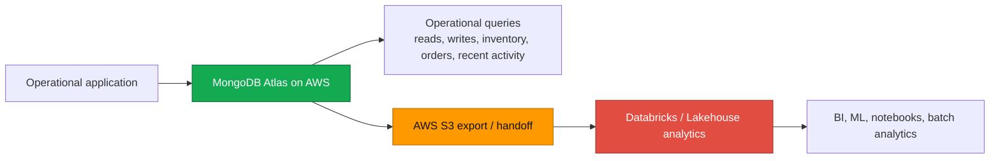

# Atlas + Databricks on AWS — Operational vs Analytics

A customer-facing demo for an AWS-centric enterprise evaluating MongoDB Atlas and Databricks together. It uses a small e-commerce workload to make one architectural point clearly: **Atlas is the operational data platform; Databricks is the analytics and ML platform.** S3 is the boundary between them.

The demo runs end-to-end in a few minutes against any Atlas cluster and does not require a Databricks workspace — the analytics side is simulated in Python and labelled accordingly, with the equivalent PySpark in `notebook_equivalent.py` for reference.

---

## Story / positioning

Most AWS-centric enterprises that already use Databricks for analytics ask the same question when MongoDB Atlas enters the picture: *"Why do I need a separate operational database — can't Databricks do this?"*

The honest answer is that they solve different problems:

| | **MongoDB Atlas** | **Databricks** |
|---|---|---|
| **Primary workload** | Live application reads/writes | Analytics, ML, BI, large transformations |
| **Latency target** | Single-digit milliseconds | Seconds to minutes (interactive) or hours (batch) |
| **Data shape** | Document — flexible, app-aligned | Tabular — columnar, warehouse-aligned (Delta) |
| **Concurrency** | Thousands of concurrent app users | Tens to hundreds of analyst/job sessions |
| **Schema** | Per-document, evolves with the app | Schema-on-read into typed tables |
| **Source of truth for** | The live application state | Curated, governed analytical copies |
| **Scaling axis** | Sharding for throughput, replication for HA | Cluster compute for query parallelism |

They are complementary. Atlas keeps the application fast. Databricks keeps the analyst, data scientist, and BI tool productive. The handoff between them is **S3** — and on AWS that boundary is native, cheap, and well-understood.

---
## Architecture at a glance



---

## Architecture overview

```
   ┌──────────────────────────────────────────────────────────────────────┐
   │                    AWS-centric enterprise                            │
   │                                                                      │
   │   ┌─────────────────────┐         ┌──────────────────────────────┐   │
   │   │   Application tier  │         │     Analytics tier           │   │
   │   │   (ECS / EKS / λ)   │         │     (Databricks workspace)   │   │
   │   │                     │         │                              │   │
   │   │  • Web/mobile APIs  │         │  • Notebooks (PySpark / SQL) │   │
   │   │  • Order service    │         │  • Scheduled jobs            │   │
   │   │  • Inventory svc    │         │  • MLflow training           │   │
   │   │  • Session/event    │         │  • BI (Tableau / Power BI)   │   │
   │   └──────────┬──────────┘         └───────────────┬──────────────┘   │
   │              │ ms-latency reads/writes            │ batch + stream    │
   │              ▼                                    ▼                   │
   │   ┌─────────────────────┐         ┌──────────────────────────────┐   │
   │   │   MongoDB Atlas     │ ──────► │         AWS S3               │   │
   │   │   on AWS            │ export  │   (Delta tables / Parquet)   │   │
   │   │                     │ ──────► │                              │   │
   │   │  customers          │ stream  │   /atlas-exports/2026.../    │   │
   │   │  products           │         │     customers.jsonl          │   │
   │   │  orders (embedded)  │         │     orders.jsonl             │   │
   │   │  events             │         │     events.jsonl             │   │
   │   └─────────────────────┘         └──────────────────────────────┘   │
   │                                                                      │
   └──────────────────────────────────────────────────────────────────────┘

         Operational system of record  ──►  Analytics handoff  ──►  Lakehouse
              (this demo: scripts 1–2)        (script 3)              (script 4)
```

### Why this shape

- **Atlas owns the live state.** Orders, customers, sessions, inventory — anything the app reads or writes per request lives here. Document model means an order plus its line items is one document, one read, no joins.
- **S3 is the boundary.** Already where the rest of your AWS data lakehouse lives. Atlas Data Federation can `$out` to S3 server-side, or DMS / change streams can stream into it. Either way, the analytics side never reaches into the operational database directly.
- **Databricks owns the analytical copy.** Once data lands in S3 (typically registered as a Delta table), all the warehouse-shaped work — cohort retention, LTV modelling, BI dashboards, ML training — happens on the lakehouse cluster without touching the live system.

---

## What's in this folder

| File | Purpose |
|---|---|
| `seed_atlas.py` | Seeds a small e-commerce workload into Atlas. Reproducible (`random.seed(42)`). |
| `operational_queries.py` | Five live operational query patterns against Atlas — the "app tier" workload. |
| `export_to_s3.py` | Exports each collection as JSONL to S3 (or a local stand-in if no bucket is configured). |
| `analytics_simulation.py` | Reads the exported JSONL and runs three analytics-shaped workloads — the "Databricks tier". |
| `notebook_equivalent.py` | Reference: the same three workloads written as PySpark for a Databricks notebook. Not executed. |
| `teardown.py` | Drops the demo database and removes the local export directory. |
| `.env.example` | Environment template. |
| `requirements.txt` | `pymongo`, `python-dotenv`, `boto3`. |

---

## Prerequisites

- Python 3.11+
- A MongoDB Atlas cluster (any tier; M10+ recommended for realistic latency numbers)
- Optional: an S3 bucket and AWS credentials available to `boto3` (any of the standard sources — env vars, `~/.aws/credentials`, instance role). Without these the demo writes to `./_s3_export/` and still works end-to-end.

The cluster does **not** need to be running anything from the `sample_*` datasets — this demo seeds its own database (`atlas_databricks_demo` by default) and does not modify any other namespace.

---

## Setup

```bash
cd atlas-databricks-aws-operational-vs-analytics-demo
python3 -m pip install -r requirements.txt
cp .env.example .env
# Fill in MONGODB_URI. Leave AWS_S3_BUCKET blank to use the local stand-in.
```

---

## Run steps

```bash
python3 seed_atlas.py            # 1. Seed the operational database in Atlas
python3 operational_queries.py   # 2. Run live app-tier queries against Atlas
python3 export_to_s3.py          # 3. Export to S3 (or local stand-in)
python3 analytics_simulation.py  # 4. Run the Databricks-shaped analytics workload
python3 teardown.py              # 5. Clean up
```

Each script is independently runnable and prints what it is doing in plain language so it works equally well as a live demo or as a self-paced walkthrough.

---

## What to say during the demo

### Script 1 — `seed_atlas.py`
> *"This is the data my application owns. Notice the shape — orders carry their line items inside the document. The whole order is one read, one write, one network round-trip. That's the operational pattern. If I tried to model this in a star schema I'd be joining four tables to render a single order page."*

### Script 2 — `operational_queries.py`
> *"Five patterns the live application runs constantly: profile lookup, inventory check, place-order write, recent-activity feed, and a dashboard widget. Look at the latencies — they're millisecond-scale because Atlas is built for this. This is the workload I do not want hitting an analytics cluster."*

Point at the **Pattern 5 — revenue widget** output and say:
> *"Atlas can do aggregation too. The dividing line isn't 'can it' — it's 'should it'. Live operational dashboards: yes. Multi-source historical analytics, cohort retention, ML feature engineering: no. That belongs on the lakehouse."*

### Script 3 — `export_to_s3.py`
> *"This is the boundary. Everything left of this script is the live application. Everything right of it is analytics. In production this isn't a one-shot script — it's one of three things: Atlas Data Federation `$out` writing to S3 server-side, a CDC stream powered by Atlas change streams, or the MongoDB Spark Connector reading directly from Atlas into Databricks. All three are well-trodden patterns; the demo picks the simplest so the shape is obvious."*

### Script 4 — `analytics_simulation.py`
> *"Same dataset, different workload. Customer lifetime value across all history, a category-region-month revenue cube, a behavioural funnel. These scan everything and produce wide tabular results. That's what Spark is for. The code is plain Python in the demo, but `notebook_equivalent.py` shows what it actually looks like as PySpark inside a Databricks notebook reading from the same S3 location."*

---

## Why not just Databricks?

Customers who already run Databricks sometimes ask whether they need a separate operational database at all. Three reasons it remains the right answer:

1. **Databricks is excellent at what it is built for.** Notebooks for exploratory analysis, large-scale ETL with Spark, MLflow for the full model lifecycle, Unity Catalog for governance, BI connectivity at scale. None of these are application-serving workloads. Asking a Spark cluster to handle a `find_one` on a single primary key under 100 ms at 5 000 concurrent users is a misuse of the platform — you can do it, but you will pay an enormous premium for compute that is sitting idle between queries and you will not hit the latency target consistently.

2. **Atlas is the better system of record for live application data.** Document model maps cleanly to the objects the application already serializes over HTTP, schema is allowed to evolve per-document as the app evolves, secondary indexes give predictable millisecond reads, change streams give first-class CDC for downstream systems, and the operational primitives an SRE expects — connection pools, replica-set failover, point-in-time backup, online resize, regional read preferences — are first-class concerns rather than retrofits.

3. **They are complementary, not competing.** The architecture in this demo is the one most AWS-centric enterprises converge on regardless of where they start. The application teams ship features faster against Atlas. The analytics teams ship reports and models faster on Databricks. S3 in the middle keeps the two organisations decoupled and lets each move at its own cadence.

A useful framing in a customer meeting: *"Databricks is the answer when the question starts with 'across all our…'. Atlas is the answer when the question starts with 'for this specific…'. Most enterprises need both because they ask both kinds of question every day."*

---

## AWS framing

For an AWS-centric account this architecture is unusually clean because every component is already in the cloud the customer has committed to.

### Atlas on AWS
- Available in **every commercial AWS region**, including GovCloud
- Runs inside Atlas-managed VPCs that **peer to the customer's VPC** or expose **PrivateLink endpoints** — application traffic never traverses the public internet
- **IAM-based authentication** via AWS IAM roles is supported (no static credentials in the application)
- **AWS KMS** can hold the customer-master keys for client-side field-level encryption and at-rest encryption
- Backups, snapshots, and metrics all live in the same AWS region as the cluster

### S3 as the handoff point
- Already where the customer's lakehouse storage lives
- Atlas **Online Archive** and **Data Federation `$out`** write to S3 natively, server-side, no application code
- S3 lifecycle policies handle retention without involving Atlas
- Cross-account access via **bucket policy + IAM** is the standard pattern when the Atlas and Databricks accounts differ
- Eventual destination can be **Delta on S3, Iceberg on S3, or Parquet** — all read natively by Databricks

### How this fits an AWS-centric enterprise architecture
- The operational tier (Atlas) and analytics tier (Databricks) sit in the **same AWS regions** the customer's other workloads already run in
- The boundary (S3) is the boundary the customer already uses for **every other data flow** between teams
- The security perimeter is **VPC + IAM + KMS** end-to-end — the same controls SecOps already audits
- Cost attribution is straightforward: Atlas bill (operational), S3 bill (handoff), Databricks bill (analytics). Each owned by the team that uses it.

This avoids the most common anti-pattern in mixed-platform AWS shops: an operational database living outside AWS, exporting through a VPN to a lakehouse inside AWS, with two security models and two networking models to reason about.

---

## Talk track — 15-minute version

| Time | Section | What to do |
|---|---|---|
| 0:00 – 2:00 | Open with the positioning table at the top of this README | Anchor the conversation: two platforms, different jobs |
| 2:00 – 4:00 | Show `seed_atlas.py` and one document from `orders` | "This is the operational shape — an order is one document" |
| 4:00 – 7:00 | Run `operational_queries.py` end-to-end | Point at the millisecond latencies in patterns 1–4; pause on pattern 5 to set up the boundary |
| 7:00 – 9:00 | Run `export_to_s3.py` | "Three production options for this step; we are demoing the simplest" |
| 9:00 – 11:00 | Run `analytics_simulation.py` | Same data, different workload, different platform |
| 11:00 – 13:00 | Open `notebook_equivalent.py` | "Here's the actual PySpark this maps to in a Databricks notebook" |
| 13:00 – 15:00 | Show the **Why not just Databricks?** section and ask the first 2–3 discovery questions | Hand the conversation back to the customer |

## Talk track — 30-minute version

| Time | Section | What to do |
|---|---|---|
| 0:00 – 3:00 | Positioning table and architecture diagram | Same as above, but with the diagram on screen |
| 3:00 – 6:00 | `seed_atlas.py`, then `db.orders.findOne()` in Compass / Atlas Data Explorer | Show the embedded line items and flexible product attributes |
| 6:00 – 12:00 | `operational_queries.py` walking through patterns one at a time | For each pattern: read the code, run it, comment on the latency |
| 12:00 – 16:00 | `export_to_s3.py` and the three production options | Cover Data Federation `$out`, change streams + Kinesis/MSK, MongoDB Spark Connector |
| 16:00 – 21:00 | `analytics_simulation.py` and `notebook_equivalent.py` side by side | Discuss Delta tables, Unity Catalog, MLflow as the natural next steps in Databricks |
| 21:00 – 25:00 | **Why not just Databricks?** and **AWS framing** sections | Anticipate and address the most common pushback |
| 25:00 – 30:00 | Discovery questions | Work through 4–6 of the questions below |

---

## Discovery questions for an AWS enterprise evaluating Atlas + Databricks

1. **Where does your operational application data live today, and what are the latency and concurrency targets it has to hit?** *(Surfaces whether they are forcing a warehouse to serve app traffic.)*
2. **Which AWS regions does your application run in, and does your data need to stay regional for residency reasons?** *(Sets up Atlas region selection and the multi-region story.)*
3. **What does your current path from operational data to the lakehouse look like — is it batch ETL, CDC, or direct queries against the operational store?** *(Identifies the handoff pattern they will replace or augment.)*
4. **Who owns the analytics platform, and is it the same team that owns the application database?** *(Organisational decoupling is half the value of the S3 boundary.)*
5. **How often does your application schema change, and what does a schema change cost you operationally today?** *(Plays directly to the document model's strengths.)*
6. **Where does your security perimeter sit — VPC peering, PrivateLink, IAM-based auth, KMS-managed keys?** *(Confirms Atlas can drop into the customer's existing AWS security model.)*
7. **What are your real-time use cases — fraud detection, personalisation, inventory — and which of them are blocked today by the analytical platform's latency?** *(Identifies workloads that should migrate from Databricks-as-app-database back to an operational tier.)*
8. **Where do you draw the line between an operational dashboard and an analytical dashboard, and which platform serves each one today?** *(Often reveals dashboards that are on the wrong platform.)*
9. **If you had a clean sheet of paper on AWS, would you put your operational store and your lakehouse on the same engine? Why or why not?** *(Lets the customer articulate the dual-platform answer themselves.)*
10. **What would have to be true for you to standardise on Atlas for operational and Databricks for analytics across all of your AWS workloads?** *(Forces the conversation toward concrete adoption criteria.)*

---

## Key talking points (one-liners)

- Atlas is the **system of record** for live application data; Databricks is the **system of insight** over curated copies of that data.
- The handoff is **S3** — already where the customer's lakehouse storage lives on AWS.
- Three production-grade ways to move data from Atlas to S3: **Data Federation `$out`**, **change streams + stream consumer**, **MongoDB Spark Connector** (no S3 in the path). This demo shows the simplest variant of the first option.
- Atlas on AWS supports **VPC peering, PrivateLink, IAM auth, KMS keys, every commercial region** — it slots into the customer's existing AWS security and networking model without exceptions.
- "Why not just Databricks?" — because asking a Spark cluster to serve `find_one` queries at 5 000 RPS under 100 ms is a misuse of the platform. The reverse — asking Atlas to scan 10 TB of historical events for ML feature engineering — is equally wrong. **Pick the right tool per workload, and let S3 be the seam.**

---

## Real vs mocked — full disclosure

| Component | Real | Mocked |
|---|---|---|
| MongoDB Atlas operational tier | ✅ Real cluster, real reads/writes, real indexes | — |
| Operational query patterns and latencies | ✅ Real PyMongo against the live cluster | — |
| S3 export (with `AWS_S3_BUCKET` set) | ✅ Real `boto3` upload to a real bucket | — |
| S3 export (with `AWS_S3_BUCKET` blank) | — | ⚠️ Writes to `./_s3_export/` as a local stand-in. Same on-disk shape as S3. |
| Databricks analytics workload | — | ⚠️ Runs in plain Python over the exported JSONL. `notebook_equivalent.py` shows the PySpark this would be in production. |
| Production export mechanisms (Data Federation `$out`, CDC) | — | 📖 Discussed in the README and talk track, not implemented |

The mocked pieces are clearly labelled at runtime — the export script prints `(local stand-in for S3)` when it is not talking to a real bucket, and the analytics script prints `(running in plain Python; see notebook_equivalent.py for PySpark)` before it begins.
