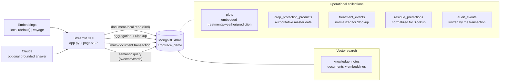

# CropTrace — MongoDB Atlas Architecture Demo

A GUI-first, presenter-ready story for evaluating a migration of remaining
**CropTrace** application components — currently on **DynamoDB**, weighed against
**Aurora PostgreSQL** — onto **MongoDB Atlas**. CropTrace predicts crop-residue
risk at harvest for fruit and vegetable growers by combining treatment plans,
weather, crop-protection-product data, and crop/plot information.

Six independent demo routes each stand alone, so a presenter can cover one topic
or hand a single topic to a colleague. Every route follows the same shape —
**business problem → interaction → MongoDB mechanism → trade-off** — with
presenter notes and a reset button.

> **This is illustrative.** It is a storytelling and discovery tool, not a
> production system. All data is synthetic and every grower, plot, and product
> name is invented. The framing is deliberately even-handed: each route names
> where a relational design may be the better fit.

---

## The six routes

| # | Route | Atlas capability it makes concrete |
|---|---|---|
| ① | **Data model & schema validation** | Embedded plot documents for data read together, plus a governed `$jsonSchema` validator (flexible ≠ uncontrolled). |
| ② | **Master data & controlled duplication** | A tiny display snapshot on each treatment vs the authoritative product record resolved live. |
| ③ | **Aggregation & $lookup** | A real decision pipeline (`$match`/`$lookup`/`$project`/`$sort`) with timing, indexes, and explain plan. |
| ④ | **ACID transaction scenario** | A multi-document transaction with a safe simulated-failure rollback and an audit trail. |
| ⑤ | **Seasonal scale & operations** | Synthetic seasonal demand + an even-handed Atlas-vs-Aurora sizing checklist (no unsupported cost claims). |
| ⑥ | **AI: Voyage + Vector Search + Claude** | Retrieval-first, grounded assistant over a synthetic corpus. Runs with no API keys, too. |

A seventh page, **🩺 Demo Readiness**, checks connectivity, seed, validators,
indexes, vector search, and optional AI keys — and offers one-click seed + index.

## Architecture



The full source is in [`assets/architecture.mmd`](assets/architecture.mmd).

### Data model

| Collection | Function |
|---|---|
| `plots` | The plot view *read together*: embedded `treatments`, `weather_observations`, and `residue_prediction`. Governed by a `$jsonSchema` validator. |
| `crop_protection_products` | Authoritative, frequently-updated master data. Validated; referenced by treatments, not copied into them. |
| `crops` | Crop + variety reference data. |
| `treatment_events` | Normalized treatments (validated) so the aggregation / `$lookup` route has real cross-collection relationships to resolve. |
| `residue_predictions` | Normalized residue predictions, joined by `$lookup` on the aggregation route. |
| `audit_events` | Written by the ACID transaction workflow — the second document that must commit atomically with a plan change. |
| `knowledge_notes` | Synthetic guidance corpus **plus a vector `embedding`**. The Knowledge Assistant's only grounding source. |

---

## Prerequisites

- Python 3.11+
- A MongoDB Atlas cluster (a replica set — required for the transaction route).
  Use the cluster from `atlas-cluster-provisioning`; this project never creates
  clusters or invokes Terraform.
- A database user with read/write access, and your IP on the Atlas Access List.

## Setup

```bash
cd croptrace-mongodb-architecture-demo
python3 -m pip install -r requirements.txt
cp .env.example .env
```

Edit `.env` and set at least `MONGODB_URI`. The defaults use the built-in
**local** embedder (no API key), so nothing else is required to run.

```env
MONGODB_URI="mongodb+srv://<username>:<password>@<cluster-host>/?retryWrites=true&w=majority"
MONGODB_DB_NAME="croptrace_demo"
EMBEDDING_PROVIDER="local"
EMBEDDING_DIM="256"
```

## Seed data & create the vector index

Seeding is idempotent — it drops and re-creates the demo collections, applies
the JSON Schema validators, inserts the synthetic data, and embeds the knowledge
corpus. Then create the Atlas Vector Search index.

```bash
python3 seed_data.py                 # synthetic plots, products, treatments, notes
python3 scripts/create_indexes.py    # Atlas Vector Search index (async build)
python3 scripts/status.py            # confirm every readiness check is green
```

> `EMBEDDING_DIM` must match the vectors you seeded. With the default local
> embedder that is `256`; re-run `create_indexes.py` after any provider change.
> Atlas builds the vector index asynchronously (allow 1–2 minutes). Until it is
> queryable, the Knowledge Assistant falls back to an in-app cosine scan so the
> demo still works.

## Run the app

```bash
streamlit run app.py
# or honor STREAMLIT_SERVER_PORT from .env:
streamlit run app.py --server.port ${STREAMLIT_SERVER_PORT:-8501}
```

> No seed data? Open the **🩺 Demo Readiness** page and use **Seed demo data**,
> then **Create Vector Search index** — the equivalent of the CLI steps above.

---

## Presenter guide

Every route has a **🎤 Presenter notes** accordion with a 60–90 second talk
track, the exact click path, the technical takeaway, and the honest caveat. A
suggested order for a full walkthrough:

1. **Data model & validation (2 min).** Open a plot document — one read returns
   its treatments, weather, and prediction. Show the separate authoritative
   product collection, then the active `$jsonSchema`. Attempt an invalid write
   (rejected by Atlas) and a valid write (accepted, then removed).
2. **Master data & duplication (2 min).** Update a product's status/guidance and
   show that every treatment resolves the new authoritative value live, while
   the frozen display snapshot deliberately does not move.
3. **Aggregation & $lookup (2 min).** Pick a plot, run the decision pipeline,
   read the rows/timing/indexes, open the explain plan, then contrast the
   document-local read of the same plot.
4. **ACID transactions (2 min).** Run the plan change *with* a simulated failure
   (nothing persists), then *successfully* (both writes commit); review the
   audit trail. Requires a replica-set cluster.
5. **Seasonal scale (1 min).** Adjust the workload assumptions, read the
   seasonal demand curve, and walk the Atlas-vs-Aurora sizing checklist. No
   dollar figure is shown without verified pricing inputs.
6. **Knowledge Assistant (2 min).** Ask a grower question; show the retrieved
   sources *before* the answer, then the grounded answer with its mode label.

## Embeddings & the optional AI provider

Embeddings are isolated in `lib/embeddings.py` behind a small interface, so the
demo is never hardwired to a paid provider.

- **`local` (default)** — deterministic feature-hashing embedder. Zero
  dependencies, no API key, runs anywhere. This is the demo's **no-keys mode**.
- **`voyage`** — production-grade semantics via Voyage AI. Set in `.env`:

```env
EMBEDDING_PROVIDER="voyage"
EMBEDDING_DIM="1024"
VOYAGE_API_KEY="..."
```

Then `pip install voyageai`, re-run `seed_data.py`, and re-run
`scripts/create_indexes.py`.

**Claude answers are optional.** Without `ANTHROPIC_API_KEY`, the Knowledge
Assistant still runs vector retrieval and returns a clearly-labelled *extractive*
answer built only from the retrieved snippets — never free-form model output.
Set the key (`ANTHROPIC_MODEL` defaults to `claude-haiku-4-5`) to enable
grounded Claude answers. All keys are read **server-side only** and are never
displayed.

## Tests

```bash
python3 -m pytest tests -v
```

Offline tests compile every page/script, import every module, and exercise the
builders, the local embedder, and the pipeline construction — so they pass with
**no cluster**. Connectivity- and transaction-guarded tests run against a
reachable Atlas replica set and **skip cleanly** otherwise, so the suite never
fails for environmental reasons.

## Tear down

Drops the demo's vector index, drops the demo database (all collections), and
frees the Streamlit port. Only touches this demo's database.

```bash
python3 teardown.py                  # prompts, then tears everything down
python3 teardown.py --yes            # no prompt
python3 teardown.py --keep-db        # only drop the index + free the port
python3 teardown.py --port 8502      # override the Streamlit port to free
```

## Files

| File | Purpose |
|---|---|
| `app.py` | Streamlit landing page: the workload, the six routes, and the even-handed frame. |
| `pages/1_Data_Model_and_Validation.py` … `7_Demo_Readiness.py` | The six independent demo routes + the readiness page. |
| `seed_data.py` | Idempotent seed: validators, synthetic data, and knowledge embeddings. |
| `scripts/create_indexes.py` | Creates the Atlas Vector Search index. |
| `scripts/status.py` | Prints every demo-readiness check from the CLI. |
| `teardown.py` | Drops the vector index + demo database and frees the Streamlit port. |
| `lib/atlas_client.py` | Cached Atlas client, collection names, and demo-id allowlists. |
| `lib/schema.py` | `$jsonSchema` validators and their apply/inspect helpers. |
| `lib/sample_data.py` / `lib/knowledge.py` | Synthetic operational data and the guidance corpus. |
| `lib/queries.py` / `lib/master_data.py` / `lib/transactions.py` | Aggregation, master-data resolution, and the transaction workflow. |
| `lib/embeddings.py` / `lib/ai.py` | Pluggable embedder and the retrieval-first, optionally-grounded assistant. |
| `lib/readiness.py` / `lib/ui.py` | Readiness checks and shared Streamlit chrome. |
| `assets/architecture.mmd` | Mermaid source for the architecture diagram. |

## Data safety

100% synthetic, fictional data. Grower, plot, and product names are invented and
correspond to no real person, farm, company, or brand. No real customer data is
used. API keys are read server-side only and are never displayed.

## Troubleshooting

- **`Missing MONGODB_URI`** — copy `.env.example` to `.env` and set it.
- **Transaction route errors** — transactions require a replica-set cluster;
  Atlas clusters qualify. A standalone `mongod` does not.
- **No knowledge results / "not queryable"** — ensure `create_indexes.py`
  finished and the vector index has built (1–2 min), and that `EMBEDDING_DIM`
  matches your seed. The assistant falls back to an in-app cosine scan meanwhile.
- **Connection errors** — confirm your IP is on the Atlas Network Access list.
