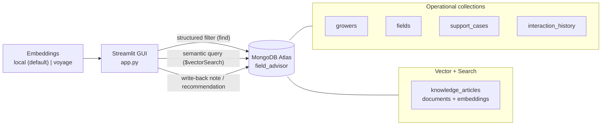

# Field Advisor — Grower Assistant on MongoDB Atlas

A GUI-first field demo for an **agriculture grower-advisory** experience, with
**MongoDB Atlas** as the single backend. It makes Atlas feel concrete and
application-facing: the same database powers **operational records** (growers,
fields, support cases, interactions) **and** **semantic vector search** over an
agronomy knowledge base — combined in one grower-facing app.

> **This is illustrative.** It is a storytelling and discovery tool, not a
> production advisory system. All data is synthetic and every grower, farm, and
> product name is invented for the demo.

---

## What the demo shows

| Atlas capability | How the demo shows it |
|---|---|
| **Operational + vector in one platform** | Growers/fields/cases are plain documents; the knowledge base carries vector embeddings. Both live in one Atlas database. |
| **Application-facing, not just infrastructure** | A Streamlit GUI with real workflows — search, an operational record view, and write-back. |
| **Hybrid retrieval** | Advisory Search runs Atlas **Vector Search** for semantics + an optional Atlas **Search** keyword pass, fused with reciprocal rank fusion, narrowed by the same structured filters used on operational data. |
| **A real product foundation** | The same app reads operational data *and* writes interaction notes / recommendations / status back to Atlas. |
| **Pluggable embeddings** | Defaults to a zero-dependency local embedder so it runs anywhere; swap to Voyage AI with two env vars. |

## The three workflows

1. **🔎 Advisory Search** — enter a natural-language grower question (e.g. *"lower
   leaves on my corn are turning yellow after rain"*), optionally filter by crop,
   region, season, product line, or severity. Atlas runs vector search over the
   knowledge base **and** filters operational `support_cases`; results are shown
   side by side, not as raw JSON.
2. **👤 Operational Context** — open a grower to see fields, open issues, product
   history, recent interactions, and the recommended next action — then **write a
   note, recommendation, or follow-up status back to Atlas** from the same app.
3. **💡 Why Atlas** — a lightweight panel that shows operational document counts
   next to vectorized knowledge counts, making it obvious both live in one Atlas
   backend combined in one experience.

---

## Architecture



### Data model

| Collection | Function |
|---|---|
| `growers` | Grower profiles: name, farm name, region, primary crops, tier, acreage. |
| `fields` | Fields per grower: crop, region, acreage, soil type, season, planting date. |
| `products` | Invented agronomy product catalog with product line and target crops. |
| `support_cases` | Advisory cases: crop, region, season, product line, severity, status, summary, recommended action, and an embedded `interactions` array. The structured-filter target. |
| `knowledge_articles` | Synthetic agronomy guidance **plus a vector `embedding`**. The semantic-search target. |
| `interaction_history` | Independent audit trail of every note/recommendation/follow-up, also written by the write-back flow. |

---

## Prerequisites

- Python 3.11+
- A MongoDB Atlas cluster (any tier — Atlas supports Vector Search on all).
- A database user with read/write access, and your IP on the Atlas Access List.

## Setup

```bash
cd field-advisor-atlas-demo
python3 -m pip install -r requirements.txt
cp .env.example .env
```

Edit `.env` and set at least `MONGODB_URI`. The defaults use the built-in
**local** embedder (no API key), so nothing else is required to run.

```env
MONGODB_URI="mongodb+srv://<username>:<password>@<cluster-host>/?retryWrites=true&w=majority"
MONGODB_DB_NAME="field_advisor"
EMBEDDING_PROVIDER="local"
EMBEDDING_DIM="256"
```

## Seed data

Creates all collections and embeds the knowledge base. Idempotent — re-running
drops and re-seeds the demo database.

```bash
python3 seed_data.py                 # 24 growers (default)
python3 seed_data.py --growers 40
```

## Create the Atlas search indexes

```bash
python3 scripts/create_indexes.py
```

This creates the **Vector Search** index (`knowledge_vector_index`) and an
optional **Atlas Search** keyword index (`knowledge_text_index`). Atlas builds
indexes asynchronously — allow 1–2 minutes before searching. The app falls back
to vector-only retrieval if the keyword index is not present.

> `EMBEDDING_DIM` must match the vectors you seeded. With the default local
> embedder that is `256`; if you re-seed with a different provider/dimension,
> re-run `create_indexes.py`.

## Run the app

```bash
streamlit run app.py
# or honor STREAMLIT_SERVER_PORT from .env:
streamlit run app.py --server.port ${STREAMLIT_SERVER_PORT:-8501}
```

> No seed data? The sidebar has a **🌱 Seed demo data** button (seed-if-empty).
> After using it, run `scripts/create_indexes.py` once so vector search works.

---

## Swapping the embedding provider

Embeddings are isolated in `lib/embeddings.py` behind a small interface, so the
demo is never hardwired to one paid provider.

- **`local` (default)** — deterministic feature-hashing embedder. Zero
  dependencies, no API key, runs anywhere. Cosine similarity reflects shared
  agronomy vocabulary, which is enough to make hybrid retrieval feel real.
- **`voyage`** — production-grade semantics via Voyage AI. Set in `.env`:

```env
EMBEDDING_PROVIDER="voyage"
EMBEDDING_DIM="1024"
VOYAGE_API_KEY="..."
```

Then `pip install voyageai`, re-run `seed_data.py`, and re-run
`scripts/create_indexes.py`. To add another backend (OpenAI, Bedrock, a
self-hosted model), implement `embed_documents` / `embed_query` on a new class
and register it in `get_embedder()`.

---

## Suggested 5-minute demo script

1. **Advisory Search (2 min).** Type *"my wheat has orange spots on the upper
   leaves"* with no filters. Show that semantic search returns the leaf-rust
   guidance even though you never typed "rust". Add a **Region** filter and note
   the operational cases panel narrow in lockstep. Open **How this works**.
2. **Operational Context (2 min).** Pick a grower, walk their open issues,
   product history, and recent interactions. Add a **recommendation** and save
   it — point out the case and `interaction_history` both update in Atlas.
3. **Why Atlas (1 min).** Land the plane: one backend, operational documents and
   vectorized knowledge side by side, combined in one experience.

## Prove the writes live in Atlas

Open the **Atlas Data Explorer** (or `mongosh`) next to the app. In Operational
Context, save an interaction, then refresh `support_cases` and
`interaction_history` in Atlas — the new interaction appears in both.

## Files

| File | Purpose |
|---|---|
| `app.py` | Streamlit GUI: advisory search, operational context (+ write-back), Why Atlas. |
| `seed_data.py` | Idempotent seed: all collections + knowledge-base embeddings. |
| `scripts/create_indexes.py` | Creates the Atlas Vector Search + optional Atlas Search indexes. |
| `lib/atlas_client.py` | Cached Atlas client, collection names, filter vocabularies. |
| `lib/embeddings.py` | Pluggable embedder (local default, Voyage optional). |
| `lib/sample_data.py` | Synthetic growers, fields, products, cases, interactions. |
| `lib/knowledge.py` | Synthetic agronomy knowledge corpus. |
| `lib/queries.py` | Hybrid advisory retrieval + operational reads/writes. |
| `assets/architecture.mmd` | Mermaid source for the architecture diagram. |

## Data safety

100% synthetic, fictional data. Grower, farm, and product names are invented and
correspond to no real person, farm, company, or brand.

## Troubleshooting

- **`Missing MONGODB_URI`** — copy `.env.example` to `.env` and set it.
- **No knowledge results** — ensure `scripts/create_indexes.py` finished and the
  vector index has built (1–2 min), and that `EMBEDDING_DIM` matches your seed.
- **Keyword hits always 0** — the optional Atlas Search index isn't built yet;
  the app still works on vector search alone.
- **Connection errors** — confirm your IP is on the Atlas Network Access list.
