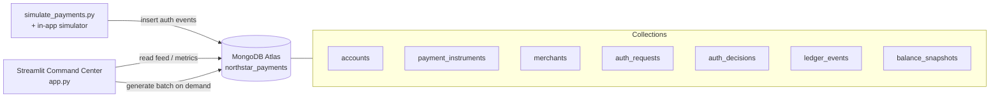

# Northstar Payments — Command Center

A GUI-first technical demo of a **fictional card authorization platform** running on a
**real GEOSHARDED MongoDB Atlas cluster** with one shard per region. It shows how Atlas
handles the hard parts of a multi-region write workload: **region-local processing with
a single cross-region view**, and **conflict resolution for the same card being used in
two regions at once** — resolved by MongoDB's single-primary serialization plus a guarded
update, with no application-level locking.

> **This is illustrative.** It demonstrates architecture and data-layer behavior; it is
> **not** a performance benchmark or a compliance certification harness. Latencies shown
> in the UI are simulated. Throughput, RTO/RPO, and payment certification are **validation
> next steps**, not proven results here.

---

## What the demo is

A Streamlit control center for **Northstar Payments**, authorizing card, tokenized-wallet,
and installment/split-tender payments across three real Atlas regions. Every event is
written to and read from a GEOSHARDED Atlas cluster where each region owns its own shard,
pinned to its own zone.

- **Owner region** — the region that owns a card's balance document. It lives on that
  shard's single primary, which is the anchor that serializes writes to that card.
- **Processing region** — where an authorization is handled. Journals (`auth_requests`,
  `auth_decisions`, `ledger_events`) are sharded by processing region so each region writes
  locally, while `mongos` still serves one logical, cross-region-visible collection.

## Atlas capabilities it demonstrates

| Capability | How the demo shows it |
|---|---|
| **Zone sharding / Global Cluster** | Three real regions (`us-east`/`US_EAST_1`, `us-west`/`US_WEST_2`, `eu`/`EU_WEST_1`), each mapped to its own zone via `updateZoneKeyRange`. Data is region-local by shard key. |
| **Single-primary serialization** | A card's balance is one document on one shard's primary. Concurrent same-card authorizations from any region are serialized there — see the **conflict scenario**. |
| **Conflict resolution without locks** | A guarded `$inc` (`available_balance: {$gte: amount}`) lets exactly one concurrent writer win the funds; the rest are declined `insufficient_funds`. No double-spend, no application lock. |
| **Exactly-once / idempotency** | A unique `{region, idempotency_key}` index (the shard key on `auth_requests`) makes a retried request return the original decision instead of charging twice. |
| **One logical cross-region view** | A single scatter-gather query over the sharded `auth_decisions` shows every region's journal as one collection. |
| **Durability & availability** | Writes use `w:"majority"` (RPO 0 within a shard) with `retryWrites` to ride out elections. |
| **Flexible document model** | Three payment event shapes share one workflow and one collection — no schema migration to add a new shape. |

---

## Architecture



A single authorization produces an `auth_requests` document (payload shape varies by
payment type), a denormalized `auth_decisions` document (so the live feed is a single
collection read), and one or more `ledger_events`. Account balances and holds update in
place via a guarded update on the owner shard; `balance_snapshots` capture point-in-time state.

### Sharding & zones

Every collection except `merchants` (small reference data) is sharded on a
**region-prefixed key** and each region's range is pinned to its own Atlas zone. On a
sharded collection a unique index must be prefixed by the shard key, so the shard key *is*
the uniqueness guarantee where the demo needs one.

| Collection | Shard key | Unique | Zoned by |
|---|---|---|---|
| `accounts` | `{region, account_id}` | ✅ one balance doc per card | owner region |
| `payment_instruments` | `{region, account_id}` | — | owner region |
| `balance_snapshots` | `{region, account_id}` | — | owner region |
| `auth_requests` | `{region, idempotency_key}` | ✅ exactly-once | processing region |
| `auth_decisions` | `{region, request_id}` | ✅ one decision per request | processing region |
| `ledger_events` | `{region, event_id}` | — | processing region |

`region` → zone → Atlas region mapping (the order must match `CLUSTER_SHARDS`):

| Demo region | Zone | Atlas region |
|---|---|---|
| `us-east` | Zone 1 | `US_EAST_1` |
| `us-west` | Zone 2 | `US_WEST_2` |
| `eu` | Zone 3 | `EU_WEST_1` |

### Collections

| Collection | Function |
|---|---|
| `accounts` | Cardholder accounts and their live financial state: `credit_limit`, `available_balance`, `hold_amount`, `region`, currency, and tier. The balance document is **owned by its region's shard primary** — the anchor that serializes same-card writes. Updated in place via a guarded `$inc`. Powers the **Accounts** view. |
| `payment_instruments` | The masked/tokenized payment methods tied to each account (1–3 per account), co-located with the owning account by `region`. Each instrument declares a `payment_type` and carries only the fields that shape applies. **No real card numbers**: `masked_number` and a random `instrument_token` only. |
| `merchants` | The synthetic merchant catalog: `name`, `merchant_category`, `mcc`, and region. Left **unsharded** on the primary shard (reference data). |
| `auth_requests` | The inbound authorization request, one per attempt, keyed by `{region, idempotency_key}`. Holds the **payment-type-specific `payload`**. The unique shard key enforces **exactly-once**: a retried key returns the original decision. |
| `auth_decisions` | The outcome per request (`approved` / `declined` / `pending`) with denormalized display fields (merchant, masked card, `region`, `owner_region`, `routing_region`, `failover_reason`, `cross_region_owner_write`, `owner_write_ms`, `risk_flags`, `latency_ms`). Denormalized so the feed/metrics/explorer are single-collection reads. |
| `ledger_events` | Money movement per authorization: a `settlement` on approval or a `hold` on pending (declines move no money), tagged with `region` and `owner_region`. The audit trail behind each account's balance and hold state. |
| `balance_snapshots` | Point-in-time balance/hold captures per account (carrying `region`), written by the seed script and periodically by the simulator. |

### What each operation in the diagram actually does

The three arrows in the diagram map to concrete reads and writes against the collections
above. This is the part worth narrating live — it shows Atlas is genuinely the system of
record, not a static dataset.

#### ➊ `insert auth events` — the standalone simulator (`simulate_payments.py`)

Each "event" is **one full authorization**, produced by `lib/simulator.py:generate_event()`.
A single call performs the following writes, in order:

1. **`auth_requests`** — one `insert_one` with the payment-type-specific `payload` and the
   `idempotency_key`. The unique `{region, idempotency_key}` shard key deduplicates retries.
2. **`accounts` (guarded money movement)** — the authoritative write, run on the **owner
   shard's primary**. It is a single guarded `update_one` that only matches when funds are
   sufficient:

   | Outcome | `accounts` guarded update | `ledger_events` write |
   |---|---|---|
   | `approved` | `update_one({..., available_balance: {$gte: amount}}, {$inc: {available_balance: -amount}})` | `settlement` (only if matched) |
   | `pending` | same guard, `$inc {hold_amount: +amount, available_balance: -amount}` | `hold` (only if matched) |
   | `declined` | *(none — no money moves)* | *(none)* |

   If the guard matches nothing (`matched_count == 0`) because a concurrent same-card write
   took the funds first, the decision flips to `declined / insufficient_funds`. This is the
   conflict-resolution mechanism — no application lock.
3. **`auth_decisions`** — one `insert_one` with the final outcome and denormalized display
   fields (including `owner_region`, `cross_region_owner_write`, and `owner_write_ms`).

So a busy account's `available_balance` and `hold_amount` visibly drift as events land —
those are real in-place `update_one` writes, not recomputed on read. On top of this, the
standalone simulator calls `take_snapshot()` every 10 ticks, which does one
`insert_many` into **`balance_snapshots`** (one document per account).

#### ➋ `generate batch on demand` — the in-app simulator (`app.py`)

Sidebar **Traffic mode** (each auto-refresh tick) and the **⚡ Generate one batch now**
button both call the same `generate_event()` path as above — so they write to exactly the
same five collections. The only difference is *how many* per tick: `_step_simulator()`
generates `SIMULATION_BATCH_SIZE` events in Normal mode and **5×** that in Burst mode. The
**🌱 Seed demo data** button additionally inserts the `accounts`, `payment_instruments`,
and `merchants` documents first, then generates a starter batch and one snapshot.

> In short: ➊ and ➋ are the **same write path**, just triggered from a terminal vs. the UI.

#### ➌ `read feed / metrics` — the dashboard and explorer (read-only)

Rendering the UI performs **no writes**. Every panel is a query in `lib/queries.py`:

| UI element | Query (in `lib/queries.py`) | Collection(s) touched |
|---|---|---|
| Live feed | `recent_feed()` — `find().sort(decided_at, -1).limit()` | `auth_decisions` |
| Headline metrics (approval rate, TPM, latency) | `dashboard_metrics()` — `$match` window + `$group` | `auth_decisions` |
| Regional volume panel | `regional_breakdown()` — `$group` by region | `auth_decisions` |
| Payment-type mix | `payment_type_mix()` — `$group` by `payment_type` | `auth_decisions` |
| Risk-flags panel | `risk_flag_counts()` — `$unwind` + `$group` | `auth_decisions` |
| Explorer search | `search_transactions()` — filtered `find()` | `auth_decisions` |
| Transaction detail | `transaction_detail()` — joins by `request_id` | `auth_decisions`, `auth_requests`, `ledger_events` |
| Accounts view | `list_accounts()` / `account_overview()` | `accounts`, `auth_decisions`, `ledger_events` |
| Global journal (scatter-gather) | `global_journal()` — `$group` by processing vs owner region | `auth_decisions` |
| Cross-region owner writes | `cross_region_writes()` — `find({cross_region_owner_write: true})` | `auth_decisions` |
| Per-shard distribution | `shard_distribution()` (in `lib/atlas_client.py`) — `collStats` per collection | all sharded collections |

Because the live feed and metrics read almost entirely from the denormalized
`auth_decisions` collection, the dashboard stays a single-collection read even under burst
traffic — which is exactly why those display fields are duplicated at write time.

#### Prove the writes live in Atlas

To show a skeptical audience that these are genuine Atlas writes — not client-side state —
open a `mongosh` session (or the **Data Explorer** in the Atlas UI) side by side with the app.

**Option A — `mongosh` (count before and after a batch):**

```javascript
use northstar_payments

// A small helper that prints the document count of every demo collection.
function demoCounts() {
  return [
    "accounts", "payment_instruments", "merchants",
    "auth_requests", "auth_decisions", "ledger_events", "balance_snapshots"
  ].map(c => ({ collection: c, count: db.getCollection(c).countDocuments() }));
}

// 1) Snapshot the counts BEFORE generating traffic:
console.table(demoCounts())

// 2) In the app, click "⚡ Generate one batch now" (or run simulate_payments.py).

// 3) Run it again and compare:
console.table(demoCounts())
```

What you should see change between the two runs:

- **`auth_requests`** and **`auth_decisions`** each grow by the batch size (one per event).
- **`ledger_events`** grows by the number of **approved + pending** events (declines write nothing).
- **`accounts`** count is unchanged, but individual balances move — watch a few update in place:

```javascript
// Most-recently-touched accounts and their live balance / hold state:
db.accounts.find(
  {}, { _id: 0, account_id: 1, available_balance: 1, hold_amount: 1, updated_at: 1 }
).sort({ updated_at: -1 }).limit(5)
```

**Option B — Atlas Data Explorer (no shell):** open **Collections**, select `auth_decisions`,
and note the document count in the header. Generate a batch in the app, then click the
**refresh** icon — the count ticks up and the newest decision appears at the top when you
sort by `decided_at` descending. Open `accounts` and refresh to watch `available_balance`
and `hold_amount` change for active accounts.

---

## Prerequisites

- Python 3.11+
- **A GEOSHARDED MongoDB Atlas cluster (required)** with three shards, one per region, in
  this exact zone order:

  | Zone | Atlas region | Demo region |
  |---|---|---|
  | Zone 1 | `US_EAST_1` | `us-east` |
  | Zone 2 | `US_WEST_2` | `us-west` |
  | Zone 3 | `EU_WEST_1` | `eu` |

  Provision it with [`../atlas-sharded-cluster-provisioning`](../atlas-sharded-cluster-provisioning/)
  using `CLUSTER_TYPE=GEOSHARDED` and a `CLUSTER_SHARDS` array whose regions match the order
  above. Sharded clusters require **M30+**. The demo also runs on a plain replica set for
  offline development — sharding steps become no-ops — but the multi-region and conflict
  stories only hold on the GEOSHARDED cluster.
- A database user with read/write access (`atlasAdmin` is needed to run `enableSharding` /
  `shardCollection`), and your current IP on the Atlas IP Access List.

## Atlas setup

1. Provision the GEOSHARDED cluster (see Prerequisites).
2. Add your IP to the **Network Access** list and create the database user.
3. Copy the **mongos** SRV connection string from **Connect → Drivers**.
4. Create your `.env`:

```bash
cp .env.example .env
```

5. Set `MONGODB_URI` (and optionally `MONGODB_DB_NAME`, default `northstar_payments`):

```env
MONGODB_URI="mongodb+srv://<username>:<password>@<geosharded-host>/?retryWrites=true&w=majority"
MONGODB_DB_NAME="northstar_payments"
```

## Install

```bash
python3 -m pip install -r requirements.txt
```

## Shard & seed data

`seed_data.py` drops the demo database, **shards the empty collections into per-region
zones** (via `scripts/shard_collections.py`), then inserts accounts/instruments/merchants
and backfills ~15 minutes of history so every document routes to its home zone. Re-running
is idempotent.

```bash
python3 seed_data.py                     # 40 accounts, 300 backfilled events
python3 seed_data.py --accounts 60 --history 500
```

You can shard or inspect the topology independently:

```bash
python3 scripts/shard_collections.py             # enable sharding + zone every collection
python3 scripts/shard_collections.py --status    # per-collection shard status + counts
```

> No seed data? The app also has a **🌱 Seed demo data** button (seed-if-empty) in the
> sidebar; it shards first, too.

## Run the app

```bash
streamlit run app.py
# or honor STREAMLIT_SERVER_PORT from .env:
streamlit run app.py --server.port ${STREAMLIT_SERVER_PORT:-8501}
```

## Run the simulator

Run in a second terminal while the app is open to push a continuous stream of events:

```bash
python3 simulate_payments.py                   # steady normal traffic
python3 simulate_payments.py --burst           # high-volume burst mode
python3 simulate_payments.py --impair eu        # impair a region and reroute its traffic
python3 simulate_payments.py --conflict         # same-card multi-region conflict + idempotency
```

You can also drive traffic entirely from the sidebar (Traffic mode + region impairment)
without a second terminal, and run the conflict scenario from the **Multi-Region & Sharding** page.

### Same-card, multi-region conflict scenario

`scripts/conflict_scenario.py` fires several near-simultaneous authorizations against ONE
card from different processing regions, each for the full balance. The card's balance
document lives on a single owner shard's primary, so those writes are serialized there —
exactly one wins the funds, the rest are declined `insufficient_funds`, and the balance
never goes negative. A second pass proves idempotent replay (same key ⇒ same decision,
charged once).

```bash
python3 scripts/conflict_scenario.py                 # contest across all regions
python3 scripts/conflict_scenario.py --amount 250     # set the contested sum
python3 scripts/conflict_scenario.py --regions us-east eu
```

## Tear down

Drops any Atlas Search indexes on the demo collections, drops the demo database
(all collections, indexes, and their zone key ranges), and frees the Streamlit port. Only
touches this demo's database — Atlas zone↔shard attachments are cluster topology and are
left intact.

```bash
python3 teardown.py                      # prompts, then tears everything down
python3 teardown.py --yes                # no prompt
python3 teardown.py --keep-db            # only drop search indexes + free the port
python3 teardown.py --clear-zone-ranges  # also remove per-region zone key ranges
python3 teardown.py --port 8502          # override the Streamlit port to free
```

---

## Suggested 5–7 minute demo script

1. **Open cold (30s).** Land on the **Dashboard**. Point out approval rate, transactions
   per minute, average simulated auth latency, and the regional volume breakdown — all
   read live from Atlas.
2. **Turn on traffic (60s).** In the sidebar set **Traffic mode → Normal** and enable
   **Auto-refresh**. Watch the live feed fill in near real time. Note the masked card
   tokens and per-event risk flags.
3. **Explore a transaction (90s).** Go to **Transaction Explorer**, filter by merchant or
   payment type, open a transaction, and show the raw request payload next to its ledger
   events. Call out that the payload *shape differs by payment type*.
4. **Tell the schema story (60s).** Open **Payment Types & Schema**. Expand the three
   payloads. Make the point: adding a new payment type is an application change, not a
   database migration.
5. **Account view (45s).** Open **Accounts**, pick an account, and walk available balance,
   pending holds, recent authorizations, and settlements.
6. **Resilience narrative (60s).** Switch **Traffic mode → Burst** and set **Region
   impairment → eu**. Watch throughput rise and rerouted authorizations appear with
   a `failover_reason`. Frame recovery objectives as a design discussion, not a proven number.
7. **Multi-region & conflict (90s).** Open **Multi-Region & Sharding**. Show the zone →
   region → shard map and the per-shard document counts (data is physically pinned to its
   home region). Run the **conflict scenario**: several near-simultaneous auths on one card
   from different regions, each for the full balance. The card's balance document lives on a
   single owner shard primary, so the writes serialize there — exactly one wins, the rest are
   declined `insufficient_funds`, and the balance never goes negative. Then show the
   idempotent replay: same key ⇒ same decision, charged once. This is the answer to
   "how do you resolve conflicts across regions" — single-primary ownership plus a guarded
   update, no application lock and no last-writer-wins data loss.
8. **Land the plane (30s).** Recap: one flexible model, real-time visibility, a simple
   operational footprint, and region-local writes with cross-region visibility on one cluster.

## Talking points for a digital-payments audience

- **Simpler modernization path** — model the payment events you actually have, instead of
  bending them into rigid tables and nullable columns.
- **Flexible modeling of payment events** — card-present, tokenized wallet, and installment
  payloads live in one workflow and one collection.
- **Real-time visibility** — authorization outcomes, holds, and regional health surface as
  they happen, powered by change streams / a clean polling fallback.
- **Easier operational model** — one managed database, one connection string, no bespoke
  streaming infrastructure to stand up for the demo.
- **Region-local writes, global visibility** — each region's data is pinned to its own
  shard/zone for locality and residency, while a single scatter-gather query gives one
  logical view across all regions.
- **Conflict resolution without data loss** — same-card contention is serialized on the
  owning shard primary and resolved with a guarded update, not last-writer-wins.

## Recommended Atlas screens to show in parallel

| Atlas screen | Why show it |
|---|---|
| **Collections (Data Explorer)** | Browse `auth_decisions` and `auth_requests` live; show the differing `payload` shapes per payment type. |
| **Metrics** | Correlate the burst mode traffic with operations/sec, connections, and cluster activity. |
| **Performance Advisor** | Discuss index recommendations as the workload grows — a natural next-step topic. |

## Horizontal scale — shard-key discussion

The demo runs on a GEOSHARDED cluster with a **region-prefixed compound shard key**
(`{ region, <id> }`) on every write collection, so the shard-key design is not
hypothetical — it is what the app uses. Why this key shape:

- **Region prefix → zone locality.** Pinning each region's range to its own zone keeps
  writes and per-region reads on the local shard and supports data-residency stories.
- **Second field → spread + uniqueness.** The trailing field (`account_id`,
  `idempotency_key`, `request_id`, `event_id`) spreads documents within a region's chunk
  and, where the demo needs it, backs the unique index (a unique index on a sharded
  collection must be prefixed by the shard key).
- **Owner-shard serialization.** Because a given card's balance document lives on exactly
  one shard primary, same-card writes serialize there — the basis of the conflict scenario.

A **hashed `account_id`** key would spread writes more evenly but gives up zone locality and
the single-owner serialization guarantee, so it is the wrong fit for this multi-region story.

See `../atlas-sharded-cluster-provisioning/` in this repo for provisioning the GEOSHARDED
topology this demo requires.

## Data safety

- 100% synthetic, fictional data. Company and merchant names are invented.
- **Never uses real PANs.** Card numbers are masked (`**** **** **** 1234`) and instruments
  are represented as random tokens only.
- No real customer data. No compliance claims of any kind.

## Explicit caveat

This is a demo, **not** a non-functional-requirements certification harness. It does not
prove a specific transactions-per-second figure, a recovery-time objective, or any payment
industry certification. Use those topics as **discussion and validation next steps**.

## How to extend this demo

- **Real change-stream consumer** — add a standalone watcher (see `../change-streams/`) that
  reacts to `auth_decisions` inserts and drives an external service.
- **Shard it** — provision a sharded/geosharded cluster and shard `auth_decisions` and
  `auth_requests` on one of the keys above.
- **Search & analytics** — add an Atlas Search index over merchants, or an aggregation-based
  fraud-signal view on top of `risk_flags`.
- **Settlement lifecycle** — expand `ledger_events` into full hold → capture → settle →
  refund transitions with reversals.

---

## Files

| File | Purpose |
|---|---|
| `app.py` | Streamlit control center (dashboard, explorer, accounts, schema story, simulator controls). |
| `seed_data.py` | Idempotent seed: accounts, instruments, merchants, backfilled history, snapshots. |
| `teardown.py` | Drops any search indexes + the demo database and frees the Streamlit port. |
| `simulate_payments.py` | Continuous synthetic authorization generator with burst and region-impairment modes. |
| `lib/atlas_client.py` | Cached Atlas client, collection names, env helpers, change-stream capability check. |
| `lib/sample_data.py` | Synthetic accounts, instruments, and merchants (masked/tokenized only). |
| `lib/simulator.py` | Builds one full authorization (request + decision + ledger) and updates balances. |
| `lib/queries.py` | Read-side aggregations for the dashboard, explorer, and account views. |
| `assets/architecture.mmd` | Mermaid source for the architecture diagram. |

## Troubleshooting

- **`Missing MONGODB_URI`** — copy `.env.example` to `.env` and set your connection string.
- **App shows "No data yet"** — run `python3 seed_data.py`, or click **🌱 Seed demo data**.
- **Feed not updating** — enable **Auto-refresh** in the sidebar, or run `simulate_payments.py`.
- **Connection errors** — confirm your IP is on the Atlas Network Access list.

