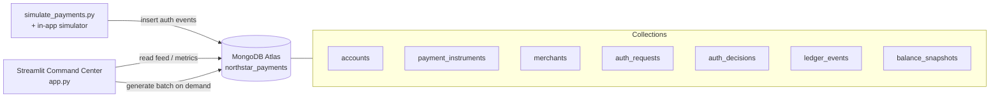

# Northstar Payments — Command Center

A GUI-first field demo for a **fictional multi-region card authorization platform**,
with **MongoDB Atlas** as the system of record. It makes Atlas feel concrete: live
payment authorization events flow in from several regions, and an operator can
inspect transactions, merchants, masked card tokens, approval/decline outcomes,
pending holds, and simple balance state — all backed by documents in Atlas.

> **This is illustrative.** It is a storytelling and discovery tool, **not** a
> performance benchmark or a compliance certification harness. Claims about
> throughput, recovery objectives, and payment certification are framed as
> **architecture discussion points and next-step validation topics**, not proven results.

---

## What the demo is

A Streamlit control center that simulates a digital payments platform (**Northstar
Payments**) authorizing card, tokenized-wallet, and installment/split-tender payments
across regions. Every event is written to and read from MongoDB Atlas.

## Why it exists

Payments modernization conversations get abstract fast. This demo grounds them in a
business-oriented UI a solutions architect can narrate live — showing *why* a flexible
document model, real-time visibility, and a simple operational model matter for an
authorization workload.

## Atlas capabilities it highlights

| Capability | How the demo shows it |
|---|---|
| **Flexible document model** | Three payment event shapes (card-present, tokenized wallet, installment/split tender) share one workflow and one collection — no schema migration to add a new shape. |
| **Real-time event handling** | The dashboard reflects new authorizations in near real time. Change streams are used where available, with a clean rerun-safe polling fallback for local reliability. |
| **Operational simplicity** | A standard Atlas connection string, a one-command seed, and a single simulator process. No bespoke infrastructure. |
| **Horizontal scale readiness** | The write path and data model are sharding-friendly (see the shard-key discussion below). |
| **Observability tie-in** | The README points you to the Atlas screens to open alongside the app. |

---

## Architecture



A single authorization produces an `auth_requests` document (payload shape varies by
payment type), a denormalized `auth_decisions` document (so the live feed is a single
collection read), and one or more `ledger_events`. Account balances and holds update in
place; `balance_snapshots` capture point-in-time state.

### Collections

| Collection | Function |
|---|---|
| `accounts` | Cardholder accounts and their live financial state: `credit_limit`, `available_balance`, `hold_amount`, region, currency, and tier. Balances and holds are updated in place as authorizations settle or place holds. Powers the **Accounts** view. |
| `payment_instruments` | The masked/tokenized payment methods tied to each account (1–3 per account). Each instrument declares a `payment_type` and carries only the fields that shape applies — the flexible-model story. **No real card numbers**: `masked_number` and a random `instrument_token` only. |
| `merchants` | The synthetic merchant catalog: `name`, `merchant_category`, `mcc`, and region. Referenced by authorizations and used for merchant filtering in the explorer. |
| `auth_requests` | The inbound authorization request, one per attempt. Holds the **payment-type-specific `payload`** (card-present terminal data, wallet cryptogram, or installment/split-tender plan) — the collection that visibly demonstrates multiple event shapes in one workflow. |
| `auth_decisions` | The outcome per request (`approved` / `declined` / `pending`) with denormalized display fields (merchant name, masked card, region, `routing_region`, `failover_reason`, `risk_flags`, `latency_ms`). Denormalized on purpose so the live feed, metrics, and explorer are single-collection reads. |
| `ledger_events` | Money movement per authorization: a `settlement` on approval or a `hold` on pending (declines move no money). The audit trail behind each account's balance and hold state. |
| `balance_snapshots` | Point-in-time balance/hold captures per account, written by the seed script and periodically by the simulator. Useful for a balance-over-time narrative and as a lightweight history alongside the live `accounts` state. |

### What each operation in the diagram actually does

The three arrows in the diagram map to concrete reads and writes against the collections
above. This is the part worth narrating live — it shows Atlas is genuinely the system of
record, not a static dataset.

#### ➊ `insert auth events` — the standalone simulator (`simulate_payments.py`)

Each "event" is **one full authorization**, produced by `lib/simulator.py:generate_event()`.
A single call performs the following writes, in order:

1. **`auth_requests`** — one `insert_one` with the payment-type-specific `payload`
   (card-present terminal data, wallet cryptogram, or installment/split-tender plan).
2. **`auth_decisions`** — one `insert_one` with the outcome and the denormalized display
   fields (merchant, masked card, region, `routing_region`, `failover_reason`, `risk_flags`,
   `latency_ms`).
3. **`ledger_events` + `accounts`** — the money movement, which depends on the outcome:

   | Outcome | `ledger_events` write | `accounts` update |
   |---|---|---|
   | `approved` | `insert_one` a `settlement` | `$inc available_balance` by `-amount` |
   | `pending` | `insert_one` a `hold` | `$inc hold_amount` by `+amount` **and** `available_balance` by `-amount` |
   | `declined` | *(none)* | *(none — no money moves)* |

So a busy account's `available_balance` and `hold_amount` visibly drift as events land —
those are real in-place `update_one` writes, not recomputed on read. On top of this, the
standalone simulator calls `take_snapshot()` every 10 ticks, which does one
`insert_many` into **`balance_snapshots`** (one document per account).

#### ➋ `generate batch on demand` — the in-app simulator (`app.py`)

Sidebar **Traffic mode** (each auto-refresh tick) and the **⚡ Generate one batch now**
button both call the same `generate_event()` path as above — so they write to exactly the
same five collections. The only difference is *how many* per tick: `_step_simulator()`
generates `SIMULATION_BATCH_SIZE` events in Normal mode and **5×** that in Burst mode. The
**🌱 Seed demo data** button additionally inserts the `accounts`, `payment_instruments`,
and `merchants` documents first, then generates a starter batch and one snapshot.

> In short: ➊ and ➋ are the **same write path**, just triggered from a terminal vs. the UI.

#### ➌ `read feed / metrics` — the dashboard and explorer (read-only)

Rendering the UI performs **no writes**. Every panel is a query in `lib/queries.py`:

| UI element | Query (in `lib/queries.py`) | Collection(s) touched |
|---|---|---|
| Live feed | `recent_feed()` — `find().sort(decided_at, -1).limit()` | `auth_decisions` |
| Headline metrics (approval rate, TPM, latency) | `dashboard_metrics()` — `$match` window + `$group` | `auth_decisions` |
| Regional volume panel | `regional_breakdown()` — `$group` by region | `auth_decisions` |
| Payment-type mix | `payment_type_mix()` — `$group` by `payment_type` | `auth_decisions` |
| Risk-flags panel | `risk_flag_counts()` — `$unwind` + `$group` | `auth_decisions` |
| Explorer search | `search_transactions()` — filtered `find()` | `auth_decisions` |
| Transaction detail | `transaction_detail()` — joins by `request_id` | `auth_decisions`, `auth_requests`, `ledger_events` |
| Accounts view | `list_accounts()` / `account_overview()` | `accounts`, `auth_decisions`, `ledger_events` |

Because the live feed and metrics read almost entirely from the denormalized
`auth_decisions` collection, the dashboard stays a single-collection read even under burst
traffic — which is exactly why those display fields are duplicated at write time.

#### Prove the writes live in Atlas

To show a skeptical audience that these are genuine Atlas writes — not client-side state —
open a `mongosh` session (or the **Data Explorer** in the Atlas UI) side by side with the app.

**Option A — `mongosh` (count before and after a batch):**

```javascript
use northstar_payments

// A small helper that prints the document count of every demo collection.
function demoCounts() {
  return [
    "accounts", "payment_instruments", "merchants",
    "auth_requests", "auth_decisions", "ledger_events", "balance_snapshots"
  ].map(c => ({ collection: c, count: db.getCollection(c).countDocuments() }));
}

// 1) Snapshot the counts BEFORE generating traffic:
console.table(demoCounts())

// 2) In the app, click "⚡ Generate one batch now" (or run simulate_payments.py).

// 3) Run it again and compare:
console.table(demoCounts())
```

What you should see change between the two runs:

- **`auth_requests`** and **`auth_decisions`** each grow by the batch size (one per event).
- **`ledger_events`** grows by the number of **approved + pending** events (declines write nothing).
- **`accounts`** count is unchanged, but individual balances move — watch a few update in place:

```javascript
// Most-recently-touched accounts and their live balance / hold state:
db.accounts.find(
  {}, { _id: 0, account_id: 1, available_balance: 1, hold_amount: 1, updated_at: 1 }
).sort({ updated_at: -1 }).limit(5)
```

**Option B — Atlas Data Explorer (no shell):** open **Collections**, select `auth_decisions`,
and note the document count in the header. Generate a batch in the app, then click the
**refresh** icon — the count ticks up and the newest decision appears at the top when you
sort by `decided_at` descending. Open `accounts` and refresh to watch `available_balance`
and `hold_amount` change for active accounts.

---

## Prerequisites

- Python 3.11+
- A MongoDB Atlas cluster (any tier). A replica set — which every Atlas cluster is —
  enables change streams.
- A database user with read/write access, and your current IP on the Atlas IP Access List.

## Atlas setup

1. Create or reuse an Atlas cluster.
2. Add your IP to the **Network Access** list and create a database user.
3. Copy your connection string from **Connect → Drivers**.
4. Create your `.env`:

```bash
cp .env.example .env
```

5. Set `MONGODB_URI` (and optionally `MONGODB_DB_NAME`, default `northstar_payments`):

```env
MONGODB_URI="mongodb+srv://<username>:<password>@<cluster-host>/?retryWrites=true&w=majority"
MONGODB_DB_NAME="northstar_payments"
```

## Install

```bash
python3 -m pip install -r requirements.txt
```

## Seed data

Creates accounts, instruments, merchants, and backfills ~15 minutes of authorization
history so the dashboard looks alive immediately. Re-running drops and re-seeds.

```bash
python3 seed_data.py                     # 40 accounts, 300 backfilled events
python3 seed_data.py --accounts 60 --history 500
```

> No seed data? The app also has a **🌱 Seed demo data** button (seed-if-empty) in the sidebar.

## Run the app

```bash
streamlit run app.py
# or honor STREAMLIT_SERVER_PORT from .env:
streamlit run app.py --server.port ${STREAMLIT_SERVER_PORT:-8501}
```

## Run the simulator

Run in a second terminal while the app is open to push a continuous stream of events:

```bash
python3 simulate_payments.py                   # steady normal traffic
python3 simulate_payments.py --burst           # high-volume burst mode
python3 simulate_payments.py --impair eu-west  # impair a region and reroute its traffic
```

You can also drive traffic entirely from the sidebar (Traffic mode + region impairment)
without a second terminal.

---

## Suggested 5–7 minute demo script

1. **Open cold (30s).** Land on the **Dashboard**. Point out approval rate, transactions
   per minute, average simulated auth latency, and the regional volume breakdown — all
   read live from Atlas.
2. **Turn on traffic (60s).** In the sidebar set **Traffic mode → Normal** and enable
   **Auto-refresh**. Watch the live feed fill in near real time. Note the masked card
   tokens and per-event risk flags.
3. **Explore a transaction (90s).** Go to **Transaction Explorer**, filter by merchant or
   payment type, open a transaction, and show the raw request payload next to its ledger
   events. Call out that the payload *shape differs by payment type*.
4. **Tell the schema story (60s).** Open **Payment Types & Schema**. Expand the three
   payloads. Make the point: adding a new payment type is an application change, not a
   database migration.
5. **Account view (45s).** Open **Accounts**, pick an account, and walk available balance,
   pending holds, recent authorizations, and settlements.
6. **Resilience narrative (60s).** Switch **Traffic mode → Burst** and set **Region
   impairment → eu-west**. Watch throughput rise and rerouted authorizations appear with
   a `failover_reason`. Frame recovery objectives as a design discussion, not a proven number.
7. **Land the plane (30s).** Recap: one flexible model, real-time visibility, a simple
   operational footprint, and a data model ready to scale out.

## Talking points for a digital-payments audience

- **Simpler modernization path** — model the payment events you actually have, instead of
  bending them into rigid tables and nullable columns.
- **Flexible modeling of payment events** — card-present, tokenized wallet, and installment
  payloads live in one workflow and one collection.
- **Real-time visibility** — authorization outcomes, holds, and regional health surface as
  they happen, powered by change streams / a clean polling fallback.
- **Easier operational model** — one managed database, one connection string, no bespoke
  streaming infrastructure to stand up for the demo.
- **Readiness for scale-out architecture** — the write path is sharding-friendly (below).

## Recommended Atlas screens to show in parallel

| Atlas screen | Why show it |
|---|---|
| **Collections (Data Explorer)** | Browse `auth_decisions` and `auth_requests` live; show the differing `payload` shapes per payment type. |
| **Metrics** | Correlate the burst mode traffic with operations/sec, connections, and cluster activity. |
| **Performance Advisor** | Discuss index recommendations as the workload grows — a natural next-step topic. |

## Horizontal scale — shard-key discussion

The demo runs on a single replica set, but the write path is designed to shard cleanly.
For an authorization workload:

- **Hashed `account_id`** — even write distribution and a natural query boundary (most
  reads in this demo are per-account or per-region). A good default for balanced growth.
- **Compound `{ region: 1, account_id: 1 }`** — pairs naturally with a **Global Cluster
  (GEOSHARDED)** topology to pin data to regional zones for data-residency stories.

See `../atlas-sharded-cluster-provisioning/` in this repo for provisioning a sharded or
geosharded topology to extend this demo toward scale-out.

## Data safety

- 100% synthetic, fictional data. Company and merchant names are invented.
- **Never uses real PANs.** Card numbers are masked (`**** **** **** 1234`) and instruments
  are represented as random tokens only.
- No real customer data. No compliance claims of any kind.

## Explicit caveat

This is a demo, **not** a non-functional-requirements certification harness. It does not
prove a specific transactions-per-second figure, a recovery-time objective, or any payment
industry certification. Use those topics as **discussion and validation next steps**.

## How to extend this demo

- **Real change-stream consumer** — add a standalone watcher (see `../change-streams/`) that
  reacts to `auth_decisions` inserts and drives an external service.
- **Shard it** — provision a sharded/geosharded cluster and shard `auth_decisions` and
  `auth_requests` on one of the keys above.
- **Search & analytics** — add an Atlas Search index over merchants, or an aggregation-based
  fraud-signal view on top of `risk_flags`.
- **Settlement lifecycle** — expand `ledger_events` into full hold → capture → settle →
  refund transitions with reversals.

---

## Files

| File | Purpose |
|---|---|
| `app.py` | Streamlit control center (dashboard, explorer, accounts, schema story, simulator controls). |
| `seed_data.py` | Idempotent seed: accounts, instruments, merchants, backfilled history, snapshots. |
| `simulate_payments.py` | Continuous synthetic authorization generator with burst and region-impairment modes. |
| `lib/atlas_client.py` | Cached Atlas client, collection names, env helpers, change-stream capability check. |
| `lib/sample_data.py` | Synthetic accounts, instruments, and merchants (masked/tokenized only). |
| `lib/simulator.py` | Builds one full authorization (request + decision + ledger) and updates balances. |
| `lib/queries.py` | Read-side aggregations for the dashboard, explorer, and account views. |
| `assets/architecture.mmd` | Mermaid source for the architecture diagram. |

## Troubleshooting

- **`Missing MONGODB_URI`** — copy `.env.example` to `.env` and set your connection string.
- **App shows "No data yet"** — run `python3 seed_data.py`, or click **🌱 Seed demo data**.
- **Feed not updating** — enable **Auto-refresh** in the sidebar, or run `simulate_payments.py`.
- **Connection errors** — confirm your IP is on the Atlas Network Access list.

