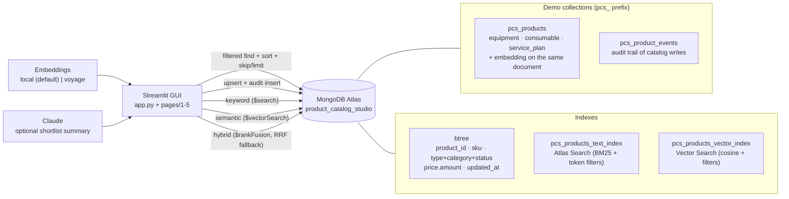

# Product Catalog Studio — a GUI-first MongoDB 101/201 session

A presenter-ready product catalog for **Kestrel Labworks**, a wholly invented
laboratory-supplies brand. The catalog sells three lines that describe themselves
with genuinely different attributes — **instruments, consumables, and service
plans** — and its shoppers arrive with imprecise wording (*"stop my reaction
vessel from overheating overnight"*) as often as with an exact SKU. Those two facts
are the whole demo: the document model absorbs the first, and Atlas Search /
Vector Search over the same documents answers the second.

Four independent routes each stand alone, so a presenter can cover one topic or
hand a single topic to a colleague. Every route follows the same shape —
**business problem → interaction → MongoDB mechanism → trade-off** — and shows the
exact query it ran. Talk tracks are in the [presenter guide](#presenter-guide)
below rather than in the app, so nothing on the customer's screen is addressed to
the presenter.

> **This is illustrative.** It is a storytelling and discovery tool, not a
> production system. All data is synthetic: Kestrel Labworks, every product, SKU,
> and price is invented and corresponds to no real company or brand. Each route
> names where a relational design may be the better fit.

---

## The four routes

| # | Route | What it makes concrete |
|---|---|---|
| ① | **Catalog explorer** (101) | One collection holding three product shapes. Filters and sorts are plain query documents served by btree indexes; the type-specific filter changes with the selected type because the field only exists on those documents. |
| ② | **Product editor** (101) | A create/edit form whose type-specific section follows the product type. One upsert stores a new document shape and re-embeds it, so no migration and no downtime are needed — plus an audit event. |
| ③ | **Find the right product** (201) | Keyword (`$search`), semantic (`$vectorSearch`), and hybrid (`$rankFusion`) retrieval over the *same* documents, sharing the *same* structured filters. |
| ④ | **Discovery checklist** | Turns the demo into the next set of questions, including an explicit list of where this design is the wrong answer. |

A fifth page, **🩺 Demo Readiness**, checks connectivity, seed, btree indexes,
both search indexes, embeddings, and optional AI keys — and offers one-click seed
plus index creation.

## Architecture



The full source is in [`assets/architecture.mmd`](assets/architecture.mmd).

### Data model

Collections are namespaced with a `pcs_` prefix so this demo can share a cluster
— or even a database — with the others in this repository.

| Collection | Function |
|---|---|
| `pcs_products` | Every product, whatever its shape. All types share `product_id`, `sku`, `name`, `summary`, `description`, `tags`, `category`, `status`, `price`. Equipment adds `specs` + `lead_time_days`; consumables add `pack` + `handling`; service plans add `coverage`, `term`, and `entitlements`. The vector `embedding` lives on the same document. |
| `pcs_product_events` | One small audit document per catalog write — action, author, timestamp, and the fields written. |

The seed inserts 18 products — six of each type. The type-specific attributes are
the point: they are not nulls on a shared table, they only exist on the documents
where they mean something.

---

## Prerequisites

- Python 3.11+
- A MongoDB Atlas cluster with **Atlas Search and Atlas Vector Search**
  available. Use the cluster from `atlas-cluster-provisioning`; this project
  never creates clusters or invokes Terraform.
- A database user with read/write access, and your IP on the Atlas Access List.

## Setup

```bash
cd product-catalog-studio
python3 -m pip install -r requirements.txt
cp .env.example .env
```

Edit `.env` and set at least `MONGODB_URI`. The defaults use the built-in
**local** embedder (no API key), so nothing else is required to run.

```env
MONGODB_URI="mongodb+srv://<username>:<password>@<cluster-host>/?retryWrites=true&w=majority"
MONGODB_DB_NAME="product_catalog_studio"
EMBEDDING_PROVIDER="local"
EMBEDDING_DIM="256"
```

## Seed data & create the search indexes

Seeding is idempotent — it drops and re-creates only this demo's `pcs_*`
collections, inserts the deterministic synthetic catalog, embeds every product,
and creates the btree indexes the explorer relies on. Then create the two Atlas
search indexes.

```bash
python3 seed_data.py                 # synthetic catalog + embeddings + btree indexes
python3 scripts/create_indexes.py    # Atlas Search + Vector Search (async build)
python3 scripts/status.py            # confirm every readiness check is green
```

> `EMBEDDING_DIM` must match the vectors you seeded. With the default local
> embedder that is `256`; re-run `create_indexes.py` after any provider change.
> Atlas builds search indexes asynchronously (allow 1–2 minutes). Until both are
> queryable, the search workspace reports the exact reason rather than silently
> returning nothing.

## Run the app

```bash
streamlit run app.py
# or honor STREAMLIT_SERVER_PORT from .env:
streamlit run app.py --server.port ${STREAMLIT_SERVER_PORT:-8501}
```

> No seed data? Open the **🩺 Demo Readiness** page and use **Seed demo data**,
> then **Create search indexes** — the equivalent of the CLI steps above.

---

## Presenter guide

Talk tracks live here, not in the app. The screen an audience sees carries only
the demo content — no speaker notes, no click paths, no reminders. Read this
section before you present; the customer never sees it.

**Suggested order for a 60-minute session.**

### 0 · Demo Readiness (2 min, before the audience is watching)

Confirm connectivity, seed, both search indexes queryable, and embeddings
present. Green across the board means every route will work.

### 1 · Catalog explorer (12 min)

*Talk track.* Everything on this page comes from one collection. Pick Equipment
and a power-source filter appears; pick Consumable and it becomes hazard class.
Those attributes are not nulls on a shared table — they only exist on the
documents where they mean something. Note the query panel: it is the literal
filter document sent to MongoDB, and adding a new attribute tomorrow needs no
migration and no downtime.

*Click path.*
1. Leave all filters open and note the total count.
2. Set *Product type = Equipment*, show the **Power source** filter.
3. Switch to *Consumable*, show the filter become **Hazard class**.
4. Narrow the price range and open **Query sent to MongoDB**.
5. Expand **Fields present per product type** at the bottom.

*Takeaway.* One collection stores several document shapes; the query document is
readable, indexed, and needs no schema migration to extend.

*Caveat to state out loud.* Flexibility shifts responsibility to the application.
On a real catalog you would add JSON Schema validators to govern the shapes.

### 2 · Product editor (12 min)

*Talk track.* Watch what happens when I change the product type: the fields below
change too, because a service plan genuinely does not have a hazard class. I will
save an invalid product first so you see the rules being enforced, then fix it
and save. The write is one upsert — no migration, no `ALTER`, no downtime — and it
also re-embeds the product, so the search page finds it straight away.

*Click path.*
1. Choose **➕ Create a new product**.
2. Set *Product type = Consumable* and note the hazard fields.
3. Clear the Summary and click **Save** → validation errors appear.
4. Restore the Summary and **Save** → success plus the audit event.
5. Open route ③ and search for the new product by its wording.

*Takeaway.* One upsert stores a new document shape and refreshes its embedding; no
schema change is required to launch a new product line.

*Caveat to state out loud.* Nothing at the database level enforces this shape yet
— production would add a `$jsonSchema` validator alongside the form rules.

### 3 · Find the right product (20 min)

*Talk track.* Two queries make the whole point. First, *"stop my reaction vessel
from overheating overnight"* — none of those words appear in the chiller document,
so Keyword mode returns one irrelevant product. Semantic mode returns the chiller
first, because it compares meaning against an embedding stored on the product
document itself. Then reverse it: search the SKU **EQP-101**. Now Semantic is the
weak one — an opaque identifier has almost no meaning to embed — while Keyword
lands it exactly. Neither mode wins on its own, which is the argument for Hybrid:
it fuses both ranked lists and gets the chiller top for *both* queries. The
architectural point: same cluster, same documents, same filters — there is no
second search system to keep in sync.

*Click path.*
1. Pick the *overheating overnight* example question.
2. Run **Keyword** mode and read the single, unrelated result.
3. Switch to **Semantic** — the chiller appears first.
4. Switch to **Hybrid** and open the fusion detail.
5. Search **EQP-101**: Keyword nails it, Semantic misses, Hybrid still ranks it
   first — the case for fusing rather than choosing.
6. Add the *Equipment* filter and re-run to show filters still apply.
7. Expand **Aggregation pipeline sent to Atlas**.

*Takeaway.* Keyword, vector, and hybrid retrieval run over the same documents in
the same cluster, sharing the same structured filters. Hybrid is what makes both a
vague description and an exact SKU work through one query path.

*Caveat to state out loud.* With 18 synthetic products, treat rank order as
illustrative — relevance quality needs a test on real data and real queries. The
default local embedder demonstrates the mechanics only; the results above were
verified with the `voyage` provider.

### 4 · Discovery checklist (10 min)

*Talk track.* I want to close by being clear about what this demo did and did not
show. It showed one collection absorbing three product shapes, a write that needs
no migration, and three retrieval modes over the same documents. It did not show
your catalog, your volumes, or your relevance requirements. So these are the
questions I would want answered before proposing anything.

*Click path.*
1. Read the three closing claims.
2. Work through the discovery questions and capture answers live.
3. Read the *where this design is the wrong answer* list out loud.
4. Agree one next step.

*Takeaway.* The demo is the start of a scoping conversation, not the proposal.

*Caveat to state out loud.* Every number on that page describes the synthetic demo
catalog, not any real deployment.

## The three retrieval modes

All three run against `pcs_products` and accept the same structured filters, so
the comparison is symmetric rather than staged.

| Mode | Stage | Behaviour |
|---|---|---|
| **Keyword** | `$search` on `pcs_products_text_index` | BM25 over `name`, `summary`, `description`, `tags`, with the UI filters as `compound.filter` token/range clauses. Strong on SKUs and exact wording, weak on paraphrase. |
| **Semantic** | `$vectorSearch` on `pcs_products_vector_index` | Cosine similarity against the `embedding` stored on the product document, pre-filtered on the same fields. Strong on intent, indifferent to shared vocabulary. |
| **Hybrid** | `$rankFusion` | Atlas ranks both legs and fuses them in one aggregation. On clusters that do not accept `$rankFusion`, both legs run separately and are fused by deterministic in-process RRF (`k=60`) — the page states which one it used. |

Each result carries a **"Why this result"** line built only from stored fields
and real retrieval metadata (BM25 score, cosine similarity, per-leg rank, fused
score). Nothing in that explanation is invented.

With `VOYAGE_API_KEY` set, an optional Voyage AI cross-encoder rerank of the
retrieved candidates becomes available; each result keeps its original retrieval
rank so the movement is visible.

## Embeddings & the optional AI provider

Embeddings are isolated in `lib/embeddings.py` behind a small interface, so the
demo is never hardwired to a paid provider.

- **`local` (default)** — deterministic feature-hashing embedder. Zero
  dependencies, no API key, runs anywhere. This is the demo's **no-keys mode**.
  It shows the mechanics of vector search, not production relevance.
- **`voyage`** — production-grade semantics via Voyage AI. Set in `.env`:

```env
EMBEDDING_PROVIDER="voyage"
EMBEDDING_DIM="1024"
VOYAGE_API_KEY="..."
```

Then `pip install voyageai`, re-run `seed_data.py`, and re-run
`scripts/create_indexes.py`.

**Claude summaries are optional.** Without `ANTHROPIC_API_KEY`, the search
workspace still runs all three retrieval modes and returns a clearly-labelled
*extractive* shortlist summary built only from the retrieved product fields —
never free-form model output. Set the key (`ANTHROPIC_MODEL` defaults to
`claude-haiku-4-5`) to enable grounded Claude summaries. All keys are read
**server-side only** and are never displayed.

## Tests

```bash
python3 -m pytest tests -v
```

Offline tests compile every page and script, import every module, and exercise
the filter builder, validation, the local embedder's determinism, the search
pipelines, the RRF fallback, and both index definitions — so they pass with **no
cluster**. Connectivity-guarded tests run against a reachable Atlas cluster and
**skip cleanly** otherwise, so the suite never fails for environmental reasons.

## Tear down

Drops this demo's two search indexes, drops the demo database (both `pcs_*`
collections), and frees the Streamlit port. Only touches this demo's database; no
Atlas cluster is ever deleted.

```bash
python3 teardown.py                  # prompts, then tears everything down
python3 teardown.py --yes            # no prompt
python3 teardown.py --keep-db        # only drop the indexes + free the port
python3 teardown.py --port 8502      # override the Streamlit port to free
```

## Files

| File | Purpose |
|---|---|
| `app.py` | Streamlit landing page: the workload, the four routes, and the honest limits. |
| `pages/1_Catalog_Explorer.py` … `5_Demo_Readiness.py` | The four independent routes + the readiness page. |
| `seed_data.py` | Idempotent seed: synthetic catalog, embeddings, and btree indexes. |
| `scripts/create_indexes.py` | Creates the Atlas Search and Vector Search indexes, and updates either one whose definition has drifted. |
| `scripts/status.py` | Prints every demo-readiness check from the CLI. |
| `teardown.py` | Drops the search indexes + demo database and frees the Streamlit port. |
| `lib/atlas_client.py` | Cached Atlas client, collection names, and the shared product vocabularies. |
| `lib/sample_data.py` | The deterministic synthetic Kestrel Labworks catalog. |
| `lib/catalog.py` | Structured filters, sorting and pagination, validation, the upsert + audit write, and the business view. |
| `lib/search.py` | Index definitions plus the keyword, semantic, and hybrid pipelines and the RRF fallback. |
| `lib/embeddings.py` / `lib/ai.py` | Pluggable embedder and the retrieval-first, optionally-grounded shortlist summary. |
| `lib/readiness.py` / `lib/ui.py` | Readiness checks and shared Streamlit chrome. |
| `assets/architecture.mmd` | Mermaid source for the architecture diagram. |

## Data safety

100% synthetic, fictional data. Kestrel Labworks is an invented brand, and every
product, SKU, specification, and price corresponds to no real company, product,
or price list. No real customer data is used. API keys are read server-side only
and are never displayed.

## Troubleshooting

- **`Missing MONGODB_URI`** — copy `.env.example` to `.env` and set it.
- **No search results / "not queryable"** — ensure `create_indexes.py` finished
  and both indexes have built (1–2 min), and that `EMBEDDING_DIM` matches your
  seed. The search page reports the exact reason rather than an empty list.
- **Hybrid reports in-process RRF** — the cluster did not accept `$rankFusion`.
  The page shows the server message; every mode still works.
- **Semantic mode returns nothing after a provider change** — re-run
  `seed_data.py` and `scripts/create_indexes.py`, since the vector index
  dimension must match the stored vectors.
- **Connection errors** — confirm your IP is on the Atlas Network Access list.
